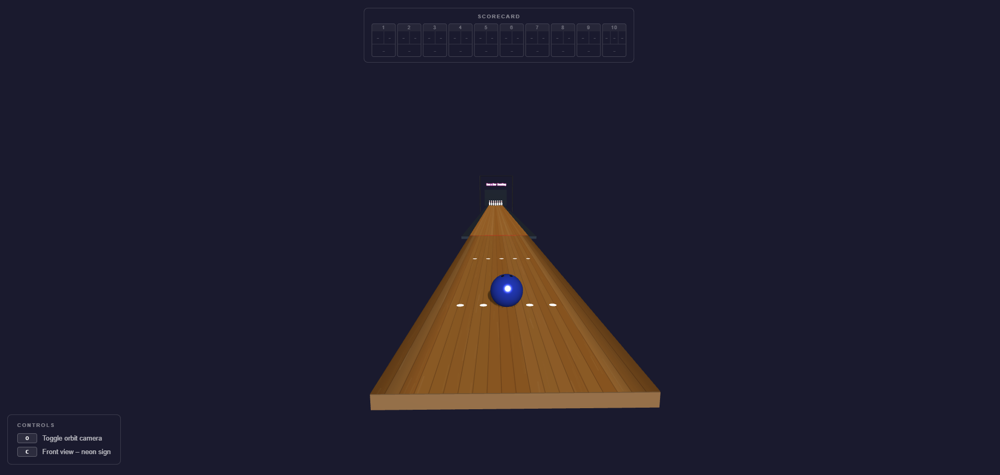
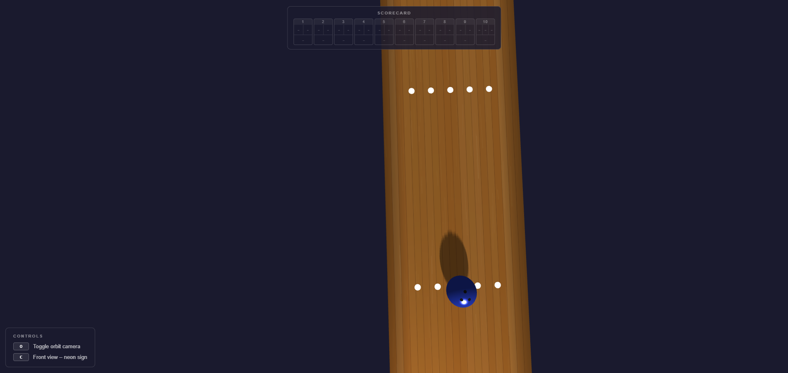
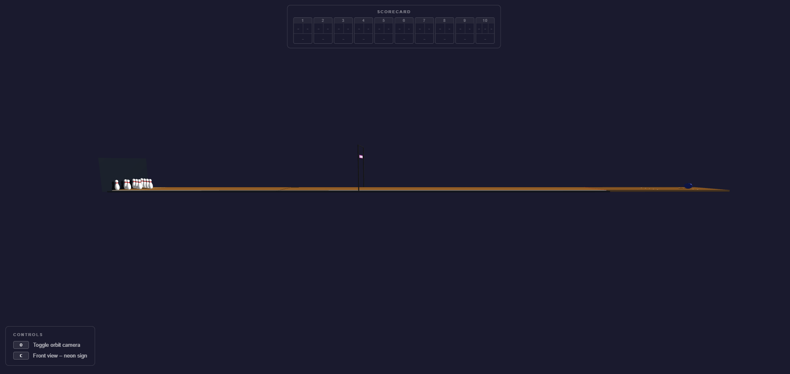
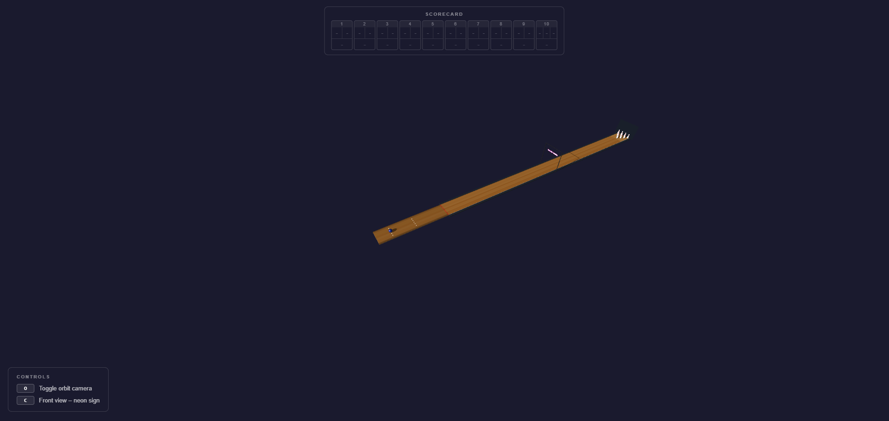
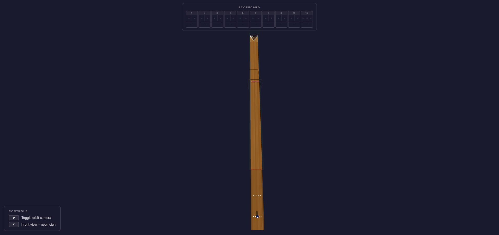
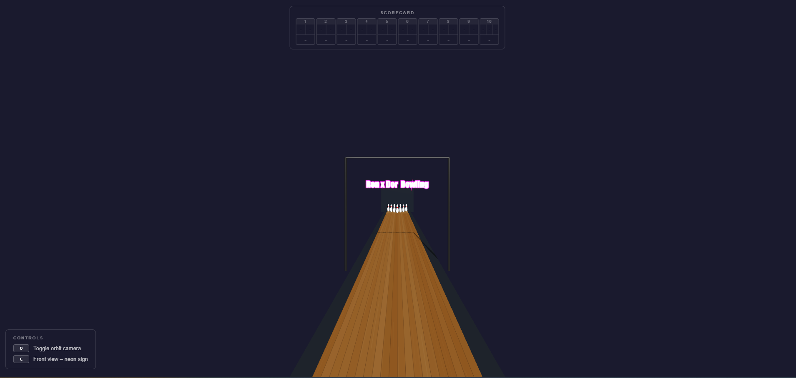

# HW05 – Bowling Alley Static Infrastructure

**Course:** Computer Graphics – Spring 2026
**Assignment:** Exercise 5 

---

## Group Members

- **Ron Reshef**
- **Dor Englender**

---

## How to Run

The project uses ES modules (`import`/`export`) for Three.js and OrbitControls, which require a proper HTTP server — opening `index.html` directly as a `file://` URL will fail with CORS errors.

**Option 1 – VS Code Live Server (recommended)**
1. Install the [Live Server extension](https://marketplace.visualstudio.com/items?itemName=ritwickdey.LiveServer).
2. Right-click `index.html` → **Open with Live Server**.

**Option 2 – Python built-in server**
```bash
# Python 3
python -m http.server 8080
# then open http://localhost:8080
```

**Option 3 – Node / npx**
```bash
npx serve .
# then open the URL printed in the terminal
```

---

### Implementation Features & Enhancements

* **Full 10-Pin Layout:** Created 10 bowling pins with a realistic, smooth 3D curved shape. Each pin includes the classic red neck stripe, carefully designed to sit perfectly on the pin without visual glitching. The pins are arranged in a perfect, standard 10-pin triangle layout.
* **Optimized Bowling Ball:** Designed a cobalt-blue bowling ball (0.35 radius) with three realistic finger holes. The holes are angled and pushed slightly inward so they fit seamlessly into the ball’s surface without sticking out.
* **Procedural Wood Textures:** Built a custom engine that generates realistic wood textures from scratch using code, meaning no external images are downloaded. It automatically creates individual wood boards, random wood grain lines, and subtle color variations. Each area has its own unique style:
  * **Lane:** Light maple wood with a polished look.
  * **Approach:** Dark walnut wood with elegant darkened edges for a high-contrast look.
  * **Pin Deck:** Warm maple wood designed to showcase the pins clearly.
* **Hanging Neon Sign:** Added a custom "Ron x Dor Bowling" neon sign hanging right over the middle of the lane. The text is drawn in ultra-high resolution so it stays perfectly sharp, and it uses a special glowing effect that makes it look like a real light-up sign. It is held up by a detailed dark-metal frame and pillars.
* **10-Frame Scorecard UI:** Created a clean interface that floats on top of the screen. It features a standard 10-frame bowling scorecard (with 2 shots for frames 1–9, and 3 shots for the 10th frame to handle strikes and spares), alongside a handy controls card showing all keyboard shortcuts.
* **Smoother Camera Controls:** Improved the camera movement (`OrbitControls`) to feel smooth and natural instead of stiff. You can now zoom in incredibly close to inspect the pins or the ball without getting blocked. Added two helpful keyboard shortcuts:
  * **O:** Freezes/unfreezes the camera view.
  * **C:** Automatically centers and straightens the camera directly in front of the neon sign for a perfect screenshot.
* **Clean Real-Time Shadows:** Calibrated the lights and shadows to ensure everything looks realistic and soft, without jagged edges. All lane markings (the red foul line, arrows, and dots) were slightly raised to completely fix any flickering or overlapping glitches on the floor.


## Submission Screenshots


#### 1. Overall Lane View
<div align="center">
  
  <p><i>Overall view of the bowling lane showcasing the complete layout with pins, distinct wood textures, and the custom hanging neon sign.</i></p>
</div>

#### 2. Close-up View of Pin Formation
<div align="center">
  
  <p><i>Close-up view showcasing the regulatory 10-pin triangular layout, detailed lathe geometry profiles, and independent shadow mapping.</i></p>
</div>

#### 3. Bowling Ball on Approach Area
<div align="center">
  
  <p><i>View showcasing the procedural bowling ball and embedded finger holes, sitting perfectly flush on the high-contrast dark walnut approach surface.</i></p>
</div>

#### 4. Camera Controls Demonstration
<div align="center">
  
  <p><i>An alternative angled perspective view demonstrating full OrbitControls functionality, responsive aspect ratio rendering, and dynamic shadow frustum execution.</i></p>
</div>


#### 5. Isometric Alley Profile
<div align="center">
  
  <p><i>An alternative long-distance side profile highlighting the structural depth of the lane body and the drop-off into the recessed gutters.</i></p>
</div>

#### 6. Top-Down Orthogonal View
<div align="center">
  
  <p><i>A strict top-down layout view verifying the perfect geometric alignment of the lane arrows, the high-contrast approach dots, and the absolute symmetry of the pin deck.</i></p>
</div>

#### 7. Custom Branding Signage Detail
<div align="center">
  
  <p><i>Close-up inspection of the custom high-DPI canvas-generated 'Ron x Dor Bowling' sign, emphasizing the low-blur, sharp vector text, and localized self-emissive lighting filters.</i></p>
</div>